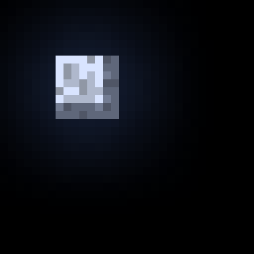
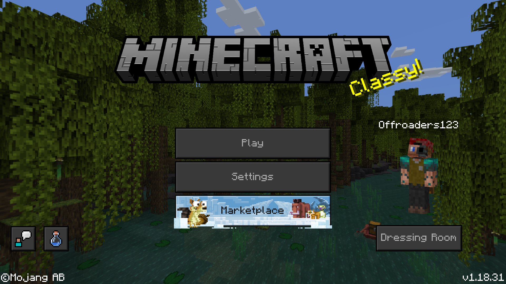
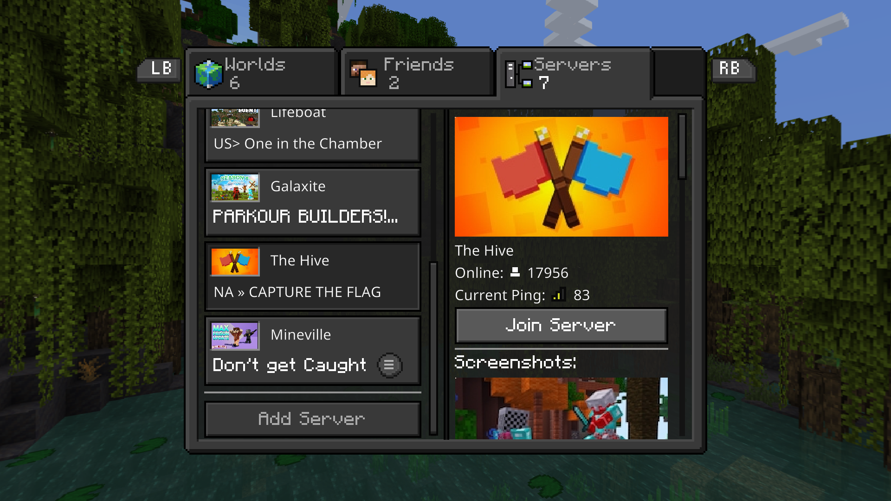
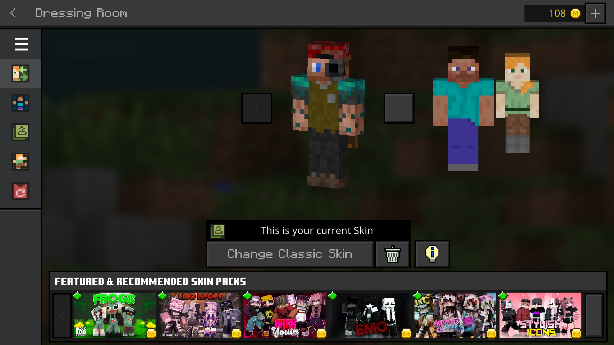
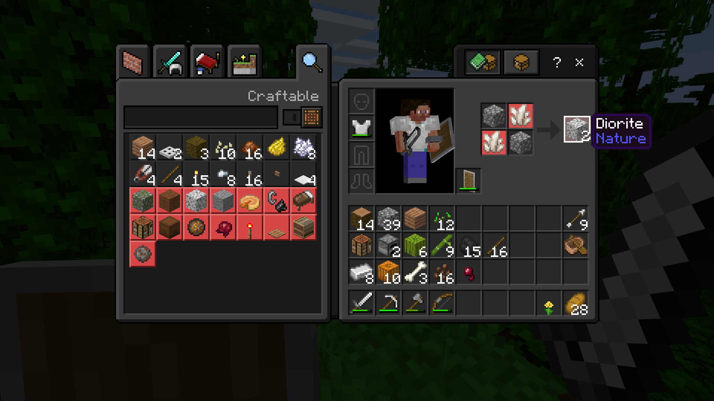
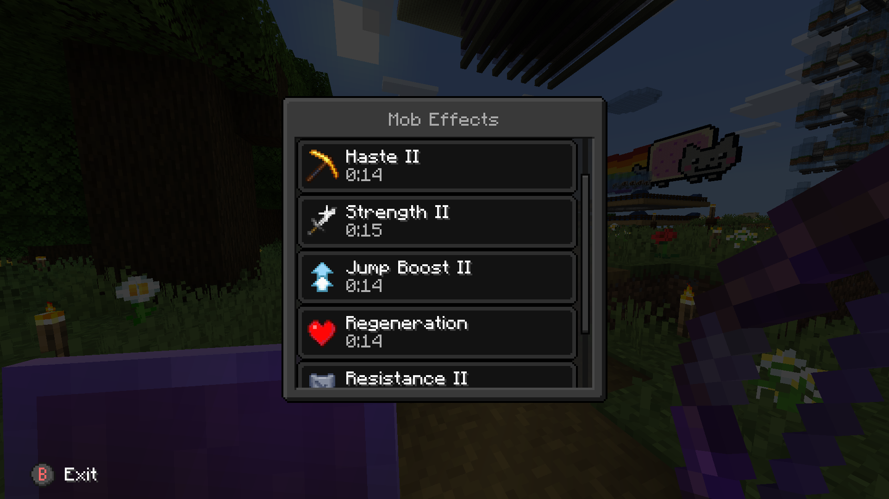
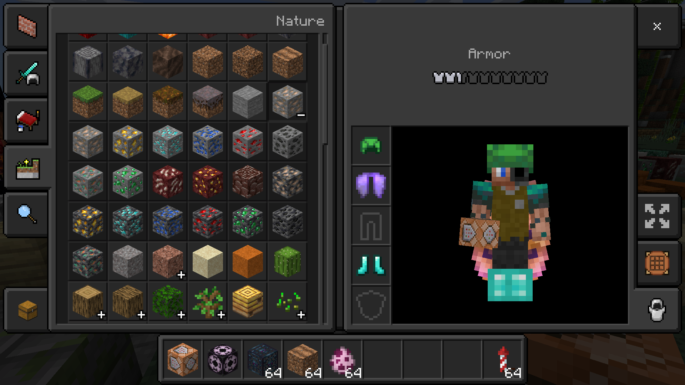

#  Dark Mode

Dark Mode is a resource pack that adds a new dark appearance to the vanilla user interface!

* Supports both Bedrock and Java Editions
* Designed to work in conjunction with vanilla textures

Want to use Dark Mode in your own project? No problem! Everything is open source on [GitHub](https://github.com/Offroaders123/Dark-Mode).

It would be kind of you to mention my username (Offroaders123) in your project when using parts of Dark Mode, but I'm not going chase after you if you don't. On the other hand, please don't plainly copy my work for your own benefit. Nobody likes that!

Found a bug, or have a new idea for Dark Mode? Feel free to [send me an email](mailto:offroaders123@gmail.com) or submit an [Issue](https://github.com/Offroaders123/Dark-Mode/issues) or [Pull Request](https://github.com/Offroaders123/Dark-Mode/pulls) over on GitHub!

## Downloads

* [Latest release](https://github.com/Offroaders123/Dark-Mode/releases/latest)

* [All releases](https://github.com/Offroaders123/Dark-Mode/releases)

* [MCPEDL (mirror)](https://mcpedl.com/dark-mode-resource-pack/)

## Screenshots

