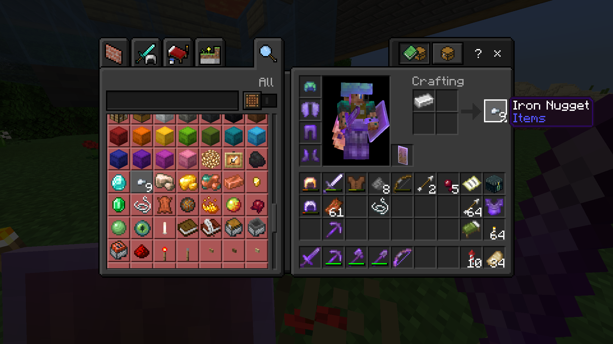

<table>
  <tr>
    <td>
      
    </td>
    <td>
      <h1>Dark Mode</h1>
    </td>
  </tr>
</table>

Dark Mode is a resource pack that adds a new dark appearance to the vanilla user interface!

* Support for Bedrock Edition
* Support for Java Edition
* Designed to work in conjunction with vanilla textures

You can share this resource pack, but please refer others to the official [MCPEDL post](https://mcpedl.com/dark-mode-resource-pack/), or this GitHub Repository only.

Feel free to include Dark Mode in your own resource pack! My only requests are for a mention of my username, "Offroaders123", and a link back to either this MCPEDL post, my MCPEDL profile, this GitHub Repository, or my GitHub profile. Thanks!

Found a bug? Have a feature suggestion? Feel free to [contact me by email](mailto:offroaders123@gmail.com), or submit a new issue to this GitHub Repository!

---

